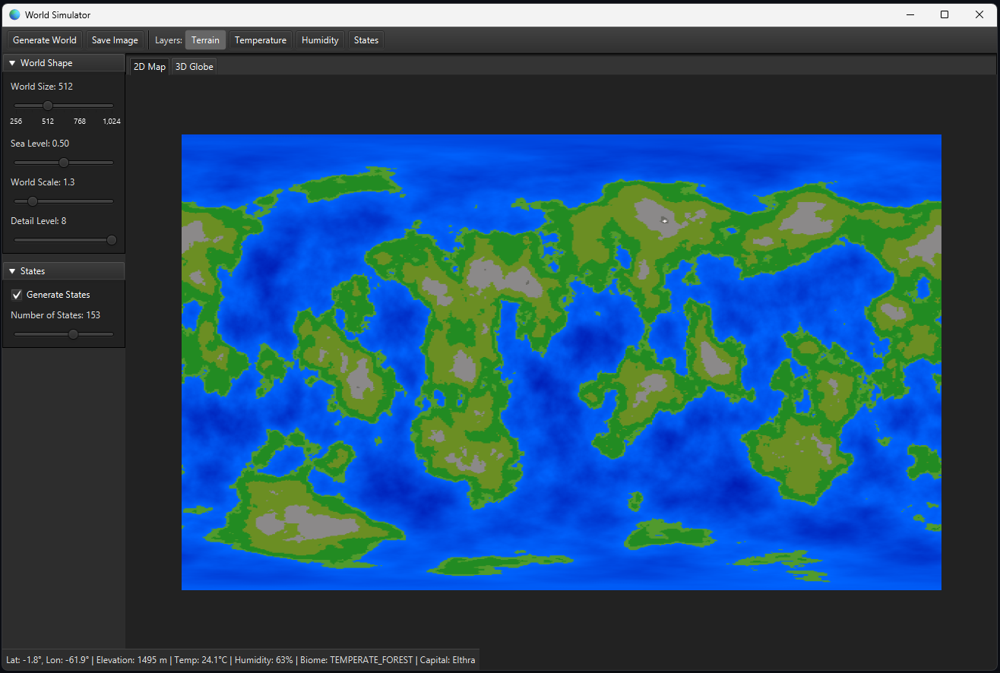
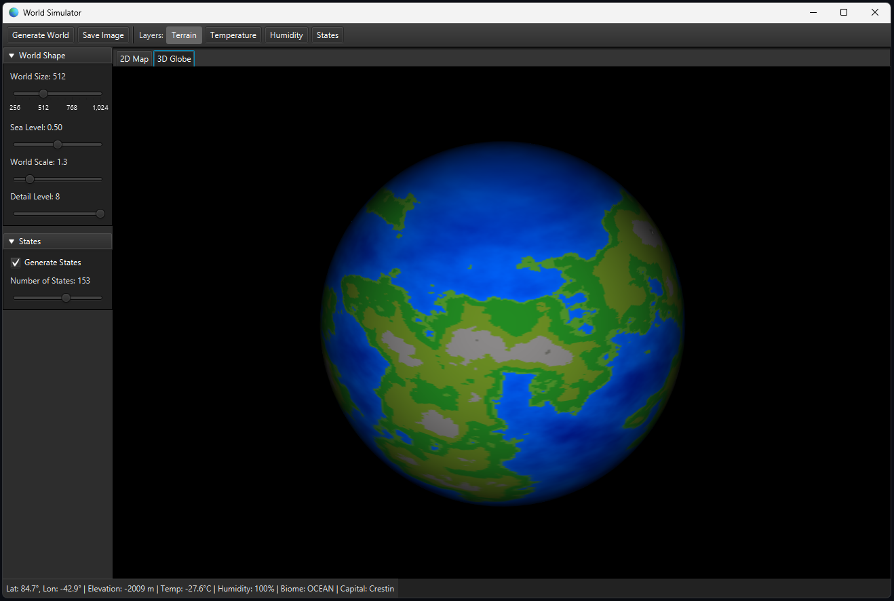
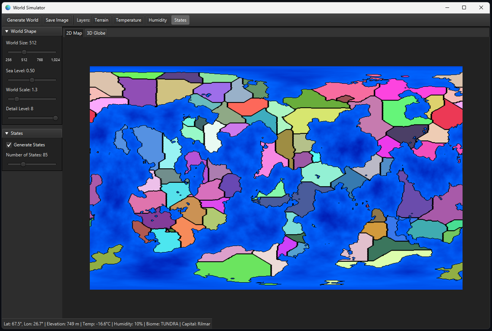

# 🌍 WorldSimulator

WorldSimulator is a JavaFX desktop application that procedurally generates unique, Earth-like planets from scratch. It builds detailed worlds complete with continents, oceans, mountain ranges, and realistic climate zones, including deserts, forests, tundra, and more.

<p align="center">
  
  
  
</p>

## 🚀 Features

* **Procedural World Generation:** Creates a unique planet every time.
* **Dual View Modes:** View the world as a 2D map or a fully interactive (and rotatable) 3D globe.
* **Dynamic Data Layers:** Switch between multiple map overlays:
    * **Terrain:** Shows elevation from deep oceans to high mountains.
    * **Temperature:** Visualizes climate zones from icy poles to a hot equator.
    * **Humidity:** Displays moisture levels.
    * **Biomes:** A detailed map of deserts, forests, grasslands, tundra, etc.
    * **States:** Procedurally generated nations with unique names and borders.
* **Customizable Generation:** Adjust parameters like **Sea Level**, **World Scale**, and **Detail Level**.
* **Detailed Tooltip:** Hover over any point on the 2D map to get precise data (latitude, longitude, elevation in meters, temperature in °C, biome, and state).
* **Save & Export:** Save the current map view as a PNG image.

## 🛠️ How It Works

The world is built using several layers of procedural generation:

1.  **Elevation:** 3D Simplex Noise is used to create a seamless heightmap on a sphere. Fractal noise (using multiple octaves) adds detail, creating everything from small hills to large mountain ranges.
2.  **Climate:** Temperature is modeled based on latitude (cold at poles, hot at equator) and modified by altitude (colder at high elevations). Humidity is generated with another noise map, with oceans always providing 100% humidity.
3.  **Biomes:** Each cell is assigned a biome based on its final elevation, temperature, and humidity, mimicking realistic ecological zones (e.g., Tundra, Desert, Rainforest).
4.  **States:** Nations are generated using **Dijkstra's algorithm**. "Capitals" are randomly placed on land and expand outwards, treating different terrain (like mountains or oceans) as "expensive" to cross, which results in natural-looking borders.

## 💻 Tech Stack

* **Java**: The core programming language.
* **JavaFX**: Used for the entire user interface, including the 2D `Canvas` renderer and the 3D `Sphere` view.
* **Simplex Noise**: The algorithm behind all procedural generation.

## 🏃 How to Run

To run this project, you will need:
* Java (JDK 17 or higher)
* JavaFX SDK (make sure it matches your Java version)

**Running from an IDE (Recommended):**

1.  Clone this repository:
    ```bash
    git clone [https://github.com/YOUR-USERNAME/YOUR-REPOSITORY.git](https://github.com/YOUR-USERNAME/YOUR-REPOSITORY.git)
    ```
2.  Open the project in your favorite Java IDE (e.g., IntelliJ IDEA, Eclipse, VS Code).
3.  Configure your IDE to use the JavaFX SDK. You will likely need to add the SDK libraries to your project and set the necessary VM options. (See: [JavaFX Getting Started](https://openjfx.io/openjfx-docs/))
4.  Run the `MainApplication.java` file.
